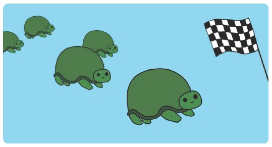

Turtle Race!

Race turtles against each other!

Adaptation from Turtle Race by Raspberry Pi Foundation:

<https://projects.raspberrypi.org/en/projects/turtle-race>

**Step 1 Introduction**

Use loops to draw a race track and create a racing turtle game.

What you will make

This project introduces **for** loops through a fun turtle race game. Loops are
used to draw the race track and to make the turtles move a random number of
steps each turn. If you have a group of people to play the game. Each person
pick a turtle and the one that gets the furthest is the winner.

**What you will learn**

>   By making your turtle race game. You will learn how to:

-   Write **for** loops in Python

-   Use random numbers in Python

-   Draw lines in different colours with Python Turtle

>   **Step 2 Racetrack**

You're going to create a game with racing turtles. First they'll need a race
track.

from turtle import \*

forward(100)

Run your code **[F5]**

Did you notice the line starts in the middle. Let’s move it to the left a bit to
give more room.

from turtle import \*

penup()

goto(-140, 140)

pendown()

forward(100)

Run your code **[F5]**

-   Now let's use the turtle to draw some track markings for the race.

The turtle **write** function writes text to the screen.

Try it:

from turtle import \*

penup()

goto(-140, 140)

pendown()

write(0)

forward(100)

write(5)

Run your code **[F5]**

-   Now you need to fill in the numbers in between to create markings:

from turtle import \*

penup()

goto(-140, 140)

pendown()

write(0)

forward(20)

write(1)

forward(20)

write(2)

forward(20)

write(3)

forward(20)

write(4)

forward(20)

write(5)

Run your code **[F5]**

-   Did you notice that your code is very repetitive? The only thing that
    changes is the number to write.

There's a better way of doing this in Python. You can use a **for** loop and
make the track longer and at the same time draw the lines going down.

Update your code to use a **for** loop:

from turtle import \*

penup()

goto(-140, 140)

pendown()

for step in range(15):

write(step, align='center')

right(90)

for num in range(8):

penup()

forward(10)

pendown()

forward(10)

penup()

backward(160)

left(90)

forward(20)

Run your code **[F5]**

Try changing some of the numbers and see what happens?  
Which section of code draws the lines going down?

>   **Step 3 Add the Turtles**

-   Now let’s bring in the Turtles and add a variable called **racespeed** so we
    can change how fast the races are as well as import **randint** which allows
    is to create random integer numbers: This is a long bit of code but it
    repeats a fair bit so maybe try using copy/paste to make it faster to input.

from turtle import \*

from random import randint

speed(0)

penup()

goto(-140, 140)

racespeed = 10

for step in range(15):

write(step, align='center')

right(90)

for num in range(8):

penup()

forward(10)

pendown()

forward(10)

penup()

backward(160)

left(90)

forward(20)

ada = Turtle()

ada.color('red')

ada.shape('turtle')

ada.penup()

ada.goto(-160, 100)

ada.pendown()

for turn in range(10):

ada.right(36)

bob = Turtle()

bob.color('blue')

bob.shape('turtle')

bob.penup()

bob.goto(-160, 70)

bob.pendown()

for turn in range(72):

bob.left(5)

ivy = Turtle()

ivy.shape('turtle')

ivy.color('green')

ivy.penup()

ivy.goto(-160, 40)

ivy.pendown()

for turn in range(60):

ivy.right(6)

jim = Turtle()

jim.shape('turtle')

jim.color('orange')

jim.penup()

jim.goto(-160, 10)

jim.pendown()

for turn in range(30):

jim.left(12)

Run your code **[F5]**

>   **Step 4 Finish the Race**

With this we now have 4 turtles called ada, bob, ivy and jim.

We also did a bit of animation of the turtles.

Try changing the numbers to see how it affects the turtles.

-   The final piece of code is to add a **Winner** variable to tell who’s won  
    Use **if** statements to know which turtle crossed the line first  
    Then display the colour of the winner. :

This looks like a really long bit of code again, but you’ve entered most of it
already. Only the section in grey is new.

from turtle import \*

from random import randint

speed(0)

penup()

goto(-140, 140)

racespeed = 10

for step in range(15):

write(step, align='center')

right(90)

for num in range(8):

penup()

forward(10)

pendown()

forward(10)

penup()

backward(160)

left(90)

forward(20)

ada = Turtle()

ada.color('red')

ada.shape('turtle')

ada.penup()

ada.goto(-160, 100)

ada.pendown()

for turn in range(10):

ada.right(36)

bob = Turtle()

bob.color('blue')

bob.shape('turtle')

bob.penup()

bob.goto(-160, 70)

bob.pendown()

for turn in range(72):

bob.left(5)

ivy = Turtle()

ivy.shape('turtle')

ivy.color('green')

ivy.penup()

ivy.goto(-160, 40)

ivy.pendown()

for turn in range(60):

ivy.right(6)

jim = Turtle()

jim.shape('turtle')

jim.color('orange')

jim.penup()

jim.goto(-160, 10)

jim.pendown()

for turn in range(30):

jim.left(12)

Winner = "None"

while (Winner == "None"):

ada.forward(randint(1,racespeed))

bob.forward(randint(1,racespeed))

ivy.forward(randint(1,racespeed))

jim.forward(randint(1,racespeed))

if ada.xcor() \>140:

Winner = "Red"

elif bob.xcor() \>140:

Winner = "Blue"

elif ivy.xcor() \>140:

Winner = "Green"

elif jim.xcor() \>140:

Winner = "Yellow"

finish = Turtle()

finish.shape()

finish.penup()

finish.goto(-100,-50)

finish.write("And the Winner is " + Winner)
